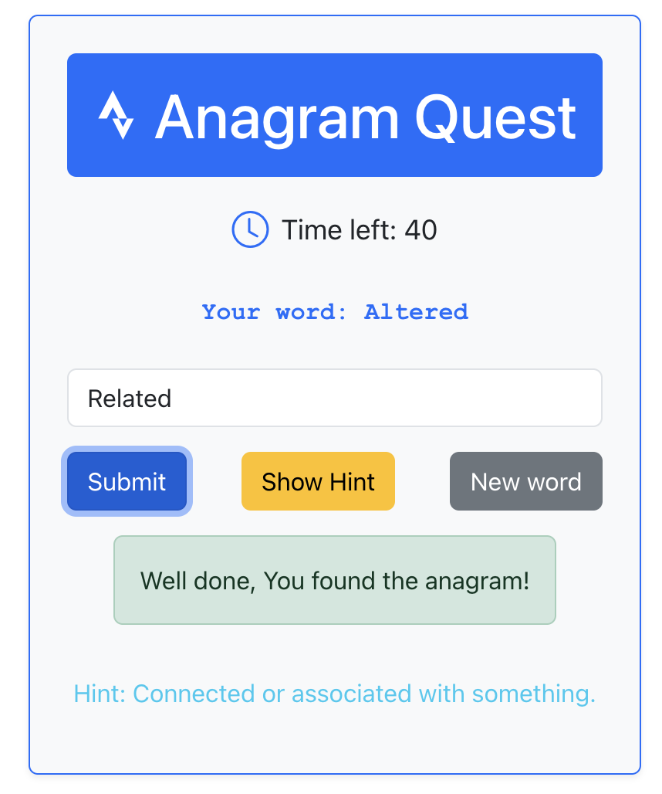
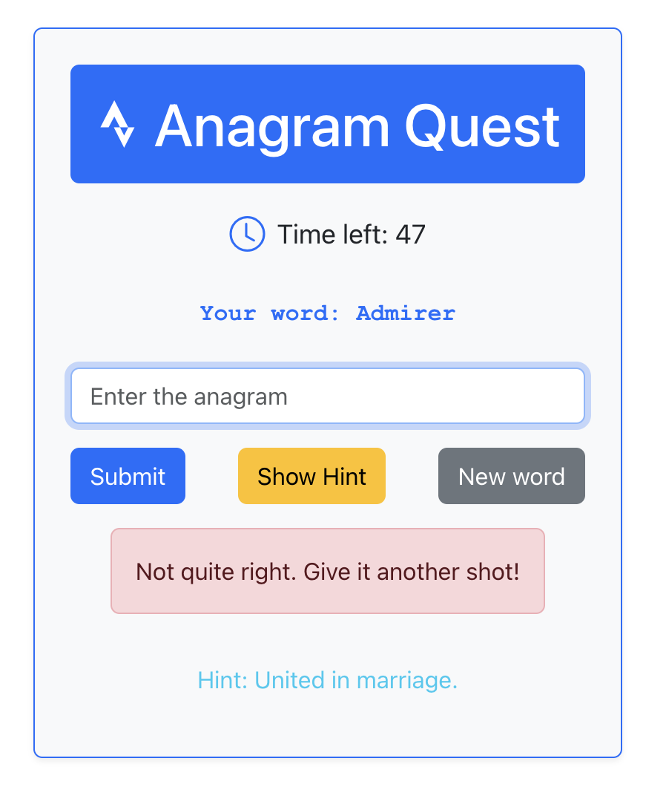
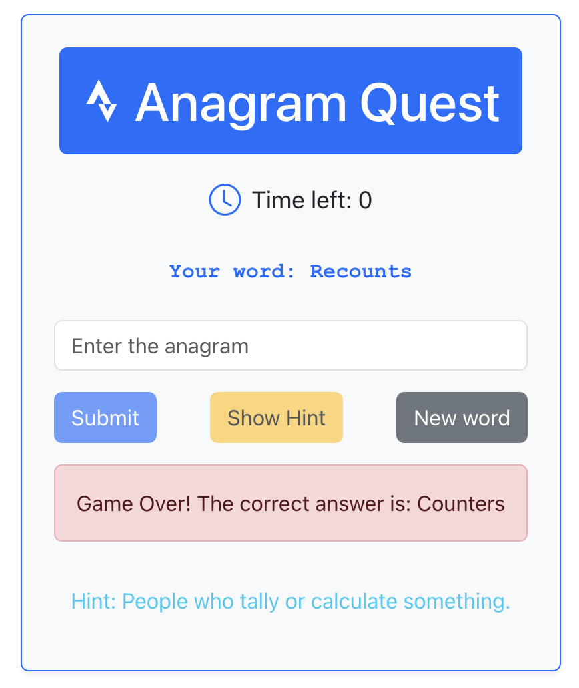

# react-games-sandbox
Lets build a simple word game where players need to guess the correct anagram within a time limit, with options to get hints and skip to new words. We will use a mix of state management and user interaction for our game logic.

# Objective of the App (Game)
The application features a word-based game centered around a curated list of anagram pairs, each accompanied by a descriptive hint.

# Gameplay Mechanics:

1. **Initial Setup**: At the start of the game, the user is presented with one word from an anagram pair.
2. **Objective**: The user’s task is to guess the corresponding anagram, which is the other word in the pair that can be formed using the same letters.
3. **Validation**: The user’s input is compared against the correct anagram. Based on this comparison, the game determines if the user’s guess is correct, leading to a win or a loss.
4. **Timer**: A countdown timer is displayed on the screen with a duration of 60 seconds. If the timer reaches zero without a correct guess, the game concludes.
5. **Skip Option**: Users have the option to skip the current word and proceed to the next one if they choose to forfeit their guess.
6. **For example**: We present the player with the word “Altered” and ask them to find its anagram, i.e. “Related”, and if user asks we provide the hint “connected or associated with something” to help him out.

# Screenshots

#  Prerequisite
1. Install Node.js and npm. ou can verify the installation in the terminal via:

``node -v``
``npm -v``

2. Make sure you have the bootstrap packages installed. Bootstrap provides a range of utility classes for text styling, including colors, alignment, and more.

``npm install bootstrap``
``npm install bootstrap-icons``

# Run 
Go to anagram-game folder in the bash and run:

``npm start``
